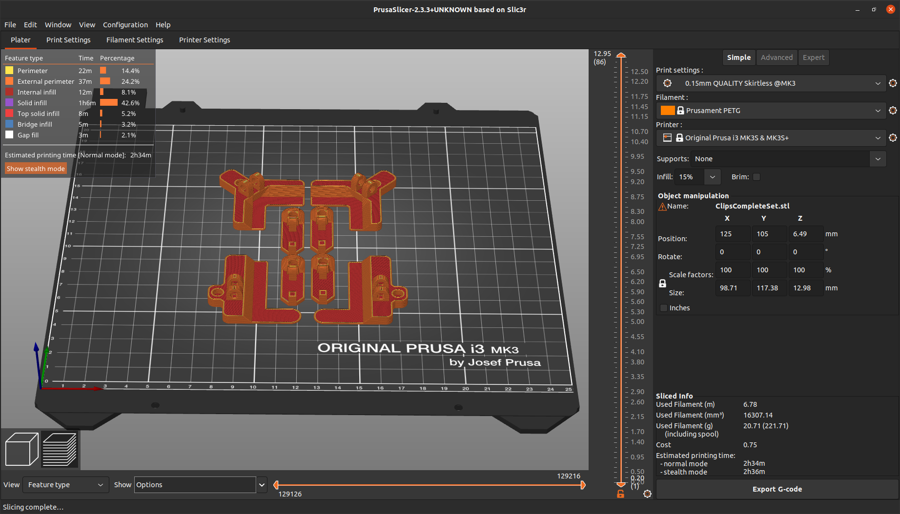

## Requirements
- PupilCore headset
- computer with Pupil Capture installed
- access to a 3D Printer and a 2D (paper) Printer
- 4 coil springs of about 5mmm diameter and 15mm length (or similar)
   
         
1. Print out the Clips-3D-Prints/ClipsCompleteSet.stl file on a 3D printer.

  

2. Each clip is composed of 2 3D-Prints and a spring. Position the 3 components as shown in the pictures below, making sure the spring is seated properly in the holes of both 3D-printed parts, and press the two 3D printed parts together around the hinge, so that they lock into place with a click. If your springs don't fit properly into your 3D printed parts, adjust the 3D-models of the clips in a 3D-modelling program (such as [Blender](https://www.blender.org/)).
3. Print out (on paper) the AprilTagsPrintout.pdf file. Cut out 4 different AprilTags from the piece of paper. They should have an edge length of 16mm-17mm. Paste the paper AprilTags on the 3D-Prints as shown below, observing which of the different AprilTags goes on which 3D-Printed clip, as well as the orientation of the AprilTags.
  
  

4. Test the clips to make sure they fit on your monitor. Check that following conditions which be met in order the the CursorControl to work properly are true:
   - The AprilTags must be located in the areas marked in blue relative to the screen.
   
   
   
   Adjust the 3D-models of the clips in a 3D-modelling program (such as [Blender](https://www.blender.org/)) to fit properly on your monitor and reprint them.
