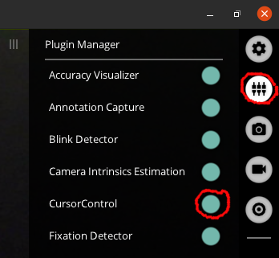

## Requirements
- PupilCore headset
- computer with Pupil Capture installed
- access to a 3D Printer and a 2D (paper) Printer
- 4 coil springs of 5mmm diameter and 15mm length (or similar) 

## External ArilTag Clips
For the CursorControl system to be able to accurately detect the position of the monitor on image frames from the video stream of the PupilCore headset's World Camera, we create 3D-printed clips onto which we paste [AprilTags](https://roboticsknowledgebase.com/wiki/sensing/apriltags/) which we can mount on the corner's of the monitor as shown in the picture below. The CursorControl plugin detects the positions of the AprilTags, then works out the shape and position of the monitor's screen's outline on the World Camera's image. See [AprilTag Clip Construction](AprilTag-Clips/AprilTagClipConstruction.md) for a step-by-step guide on making the AprilTag clips.

### AprilTag Screen-Calibration
For the CursorControl system to be able to work out the monitor's screen's outline given the positions of the external Aprilag clips, a calibration process is performed when the system starts up. This process involves displaying 4 AprilTags on the screen, so that the PupilCore headset's WorldCamera sees a monitor with 4 AprilTags physically printed onto clips mounted on the corners of the monitor and 4 AprilTags displayed by the monitors screen, in its corners. When the CursorControl plugin sees the 4 physical AprilTags on the clips and the 4 displayed AprilTags representing the corners of the screen, it measures and rembers the relative positions of the physical AprilTags and the corners of the screen, so that it can later (during normal runtime) work out the postion of the screen's corners using just the 4 physical AprilTags on the 3D-printed clips.

### Notes on Pupil CalibrationScreen
- The 2D-Pupil Calibration can yield greater accuracy than 3D Pupil-Calibration, but has its own downsides. [Read the details on PupilCore's website](https://docs.pupil-labs.com/core/best-practices/#choose-the-right-gaze-mapping-pipeline).

# Installation and Setup
1. __Create AprilTag clips:__ Follow the the guide on [AprilTag Clip Construction](AprilTag-Clips/AprilTagClipConstruction.md) to create your own AprilTag clips for the monitor you want to use this CursorControl plugin on.
2. __Add the CursorControl plugin to Pupil Capture:__ Copy the CursorControl folder in the 'Code' folder into the 'plugins' folder of PupilCapture. See [PupilCore's website](https://docs.pupil-labs.com/developer/core/plugin-api/#adding-a-plugin) on locating the plugins folder and details about adding plugins to PupilCore. The folder structure of the plugins folder should look something like this:
  
3. Make sure you are in a well-lit room. Mount your AprilTag clips from step 1 on your monitor, connect your PupilCore headset to your computer and wear it, then run Pupil Capture. Make sure that the world camera can see your entire monitor and all of the AprilTag-clips. Run Pupil Capture's pupil-calibration (I recommend the screen marker choreography). If you are new to using PupilCore, read [PupilLab's starter guide](https://docs.pupil-labs.com/core/#_1-put-on-pupil-core) first.
4. Enable the plugin to run it:

  
  
  The Screen-Calibration window will fill your monitor's screen, disappearing automatically as soon as the CursorControl plugin can recognise all the physical AprilTags on the clips as well as the on-screen ones. If the calibration screen does not diappear after a few seconds, make sure that the physical AprilTags get enough light.  
  You can check if CursorControl can recognise the AprilTag clips by switching windows to Pupil Capture. The AprilTags should be outlined in red.
  
  
  
5. Using the World Camera video stream built into Pupil Capture, ensure that the screen-recognition works correctly by observing the red lines that should outline the screen on the video stream. You may hae to move your head backwards so that the CursorControl plugin doesn't recognise the AprilTag-clips displayed on-screen in the video-stream!

  
  
  If all went well, your computer's cursor will start moving to wherever Pupil Capture thinks you're looking at on the screen!
  
