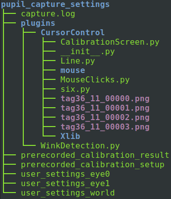

# PupilCore CursorControl Plugin
A system for using [PupilLabs](https://pupil-labs.com/)' eye-tracking [PupilCore](https://pupil-labs.com/products/core/) headset to control your computer's cursor with your eyes. 

The software part of this project is a plugin for PupilLabs' [Pupil Capture](https://docs.pupil-labs.com/core/#_1-put-on-pupil-core) program. To use CursorControl, one runs Pupil Capture and enables the CursorControl Plugin.  
CursorControl also requires mounting external clips on the corners of the monitor for the plugin to be able to see the monitor using PupilCore's World Camera.

## Project Stage of Development
So far I have focussed on getting monitor recognition on the image frames of the World Camera video stream to work reliably and on accurately mapping the user's gaze from it's position on the World Camera video stream to the user's screen, then moving the cursor to that position.  
The project is therefore currently at a proof-of-concept stage, demonstrating that an almost usable accuracy (up to around 50px on a 1920×1080px screen, an error of roughly 3% relative to the screen's width) can be achieved for cursor control using PupilCore's eye-tracking.

#### ToDo
__Gaze Mapping World-Camera to Screen:__ The current mathematical algorithm which maps the user's gaze position from the World Camera's image frame to the user's screen assumes that the image of the screen on the World Camera is approximately rectangular. A more complex algorithm that does not make this approximation should yield more accurate results.  
__Mouse Button Control:__ A lot of different methods can be used to simulate mouse clicks, such as winks, mouth-movements or keystrokes.  
__Plugin Menu:__ As users are highly likely to want to experiment with and customise the mouse-clicks part of CursorControl, I should also build a GUI plugin settings menu for this (and other things).  

## Requirements
- PupilCore headset
- computer with Pupil Capture installed
- access to a 3D Printer and a 2D (paper) Printer
- 4 coil springs of 5mmm diameter and 15mm length (or similar) 

## External ArilTag Clips
For the CursorControl system to be able to accurately detect the position of the monitor on image frames from the video stream of the PupilCore headset's World Camera, we create 3D-printed clips onto which we paste [AprilTags](https://roboticsknowledgebase.com/wiki/sensing/apriltags/) which we can mount on the corner's of the monitor as shown in the picture below. The CursorControl plugin detects the positions of the AprilTags, then works out the shape and position of the monitor's screen's outline on the World Camera's image. See [AprilTag Clip Construction](AprilTag-Clips/AprilTagClipConstruction.md) for a step-by-step guide on making the AprilTag clips.

### AprilTag Screen-Calibration
For the CursorControl system to be able to work out the monitor's screen's outline given the positions of the external Aprilag clips, a calibration process is performed when the plugin starts running. This process involves displaying 4 AprilTags in the corners of the screen, so that the PupilCore headset's WorldCamera sees a monitor with 4 AprilTags physically printed onto clips mounted on the corners of the monitor and 4 AprilTags displayed by the monitor's screen, in its corners. When the CursorControl plugin sees the 4 physical AprilTags on the clips and the 4 displayed AprilTags representing the corners of the screen, it measures and rembers the relative positions of the physical AprilTags and the corners of the screen, so that it can later (during normal runtime) work out the postion of the screen's corners using just the 4 physical AprilTags on the 3D-printed clips.

### A Note on Pupil Calibration
The 2D-Pupil-Calibration yields greater accuracy than 3D Pupil-Calibration, but has its own downsides. [Read the details on PupilCore's website](https://docs.pupil-labs.com/core/best-practices/#choose-the-right-gaze-mapping-pipeline).

## Installation and Setup
1. __Create AprilTag clips:__ Follow the guide on [AprilTag Clip Construction](AprilTag-Clips/AprilTagClipConstruction.md) to create your own AprilTag clips for the monitor you want to use this CursorControl plugin on.
2. __Add the CursorControl plugin to Pupil Capture:__ Install PupilLabs' [Pupil Capture](https://docs.pupil-labs.com/core/#_1-put-on-pupil-core) on your computer if you don't already have it. Copy this project's _Code/CursorControl_ folder into the 'plugins' folder of PupilCapture. See [PupilCore's website](https://docs.pupil-labs.com/developer/core/plugin-api/#adding-a-plugin) on locating the plugins folder and details about adding plugins to PupilCore. The directory structure of the plugins folder should look something like this:
  
3. Make sure you are in a well-lit room. Mount your AprilTag clips from step 1 on your monitor, connect your PupilCore headset to your computer and wear it, then run Pupil Capture. Make sure that the World Camera can see your entire monitor and all of the AprilTag-clips (you might need to change the lens you are using for the world camera). Run Pupil Capture's pupil-calibration (I recommend the screen marker choreography). If you are new to using PupilCore, read [PupilLab's starter guide](https://docs.pupil-labs.com/core/#_1-put-on-pupil-core) first.  
Practise in the Pupil-Calibration process is essential for good accuracy in CursorControl.
4. Enable the plugin to run it:

    
  
    The Screen-Calibration window will fill your monitor's screen, disappearing automatically as soon as the CursorControl plugin can recognise all the physical AprilTags on the clips as well as the on-screen ones. If the calibration screen does not disappear after a few seconds, make sure that the physical AprilTags get enough light, and that the World Camera can see all the AprilTags (you can check this by switching windows to Pupil Capture, e.g. using the keyboard shortcut of ALT+TAB or CMD+TAB).  
    The AprilTags should be outlined in red.
  
    
  
5. Using the World Camera video stream visualisation built into Pupil Capture, ensure that the screen-recognition works correctly by observing the red lines that should outline the screen on the video stream as shown in the picture above. You may have to move your head backwards so that the CursorControl plugin doesn't recognise the AprilTag-clips displayed on-screen in the video-stream!
  
    If all went well, your computer's cursor will start moving to wherever Pupil Capture thinks you're looking on the screen!

## Bugs
- When starting PupilCapture with the CursorControl plugin already enabled, the ScreenCalibration-screen is shown and then minimised by the appearance of the other Pupil Capture windows. One must switch windows back to the ScreenCalibration-screen to proceed.
- Disabling the CursorControl plugin seems to cause Pupil Capture to stop responding for some reason.

Tested on Ubuntu 20.

## Links
This project is also hosted on IPFS.

Source Code: https://ipfs.io/ipns/k2k4r8nekx5gmqjhqpx9h6vowf39bkxgkw8sm2nbz3o1d7su0eigaaq8  
Website: https://ipfs.io/ipns/k2k4r8kzhbfoy6m1hxph0z6gtylkkxnrkz5f5upsks53eida04h4c60d